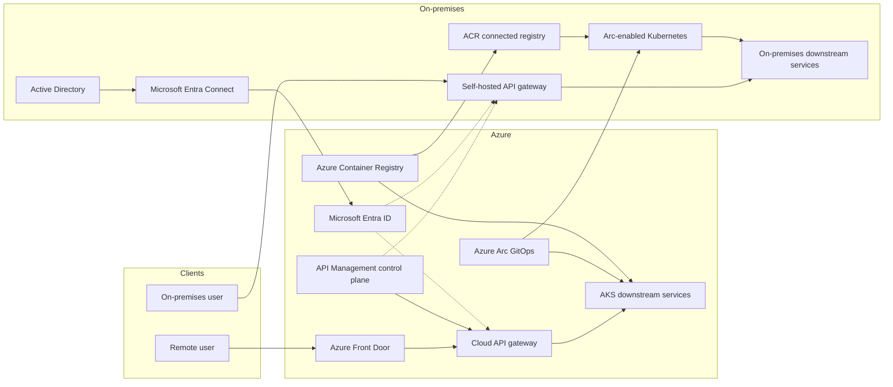
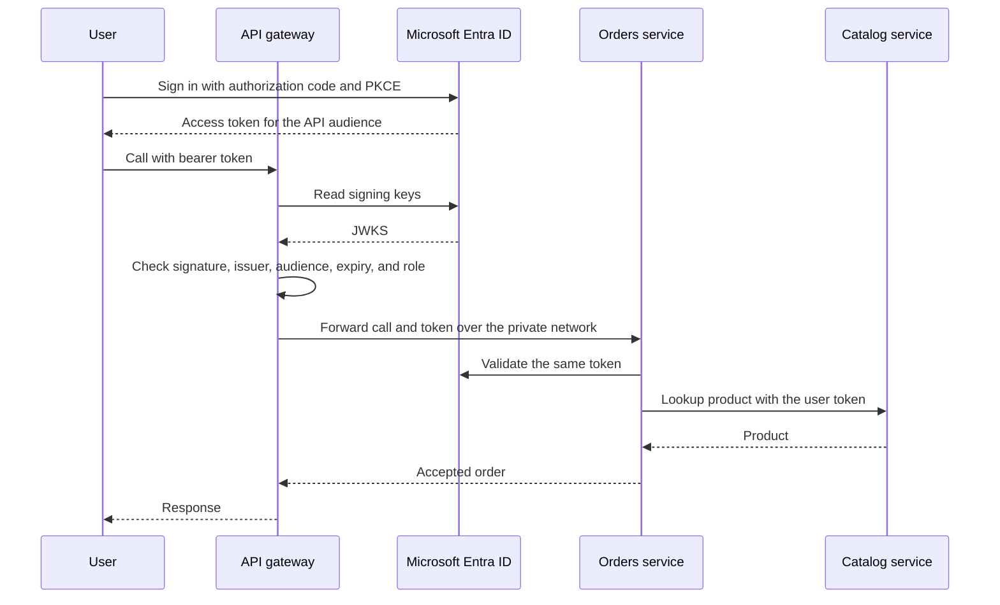
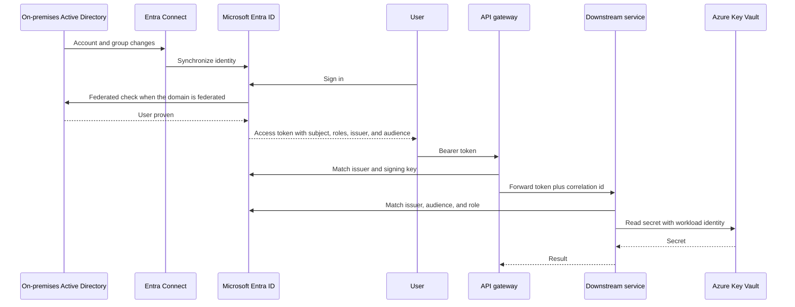
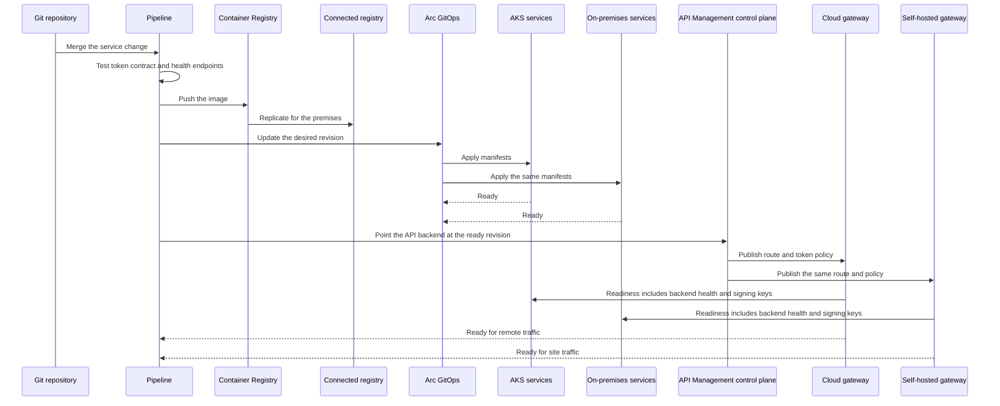
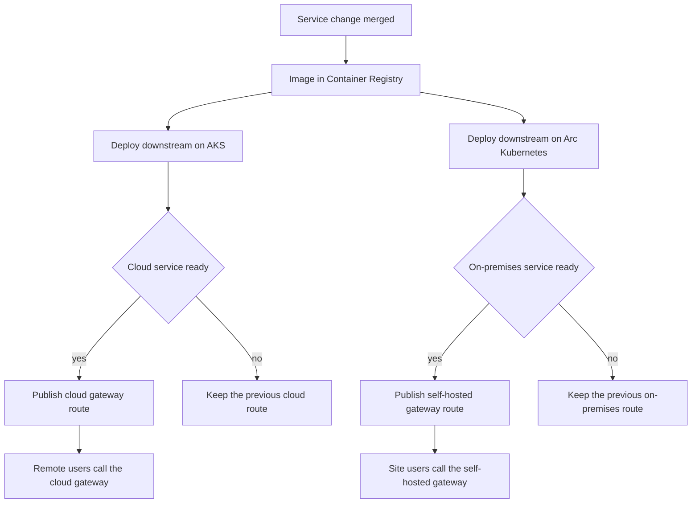
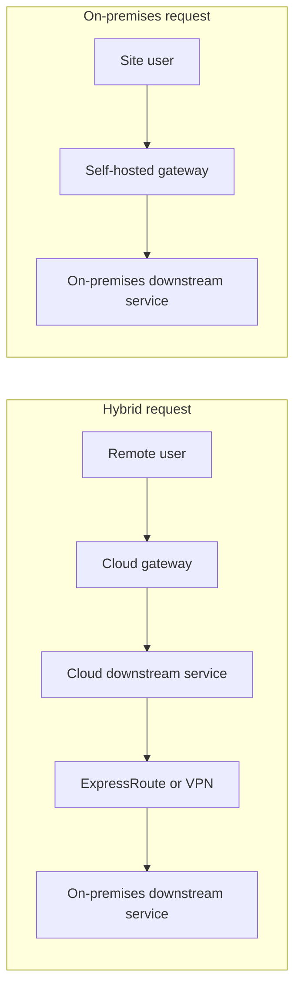

# Gateway, authentication, and deployment

Reference architecture for one interaction model that works in two placements:

- **Azure on-premises** — the data plane runs on Azure Local or Azure Stack Hub.
- **Hybrid** — the same APIs run in Azure and on-premises, with identity, network, and deployment shared through Azure.

The public entry is always an API gateway. The gateway checks the caller, then calls downstream services. Deployment updates those services first and the gateway route last, so traffic moves only after the backends are ready.

## 1. Where each part sits

| Part | Hybrid | On-premises |
| --- | --- | --- |
| User entry | Remote users use Azure Front Door and the cloud gateway. Site users use the self-hosted gateway on the premises. | Users use the self-hosted gateway on Azure Local or Azure Stack Hub. |
| Gateway control | Azure API Management holds routes, policies, and products. | Same control plane when the site can reach Azure. The gateway process still runs on-premises. |
| Downstream services | AKS in Azure and Arc-enabled Kubernetes on-premises. | Arc-enabled Kubernetes on Azure Local, or Kubernetes on Azure Stack Hub. |
| Authentication | Microsoft Entra ID. On-premises Active Directory is synced with Entra Connect. | Same, while the site is connected. A disconnected site keeps a local directory and federates when the link returns. |
| Deployment | One pipeline, Azure Container Registry, Arc GitOps to both clusters. | Same pipeline. A connected registry on-premises pulls images when the link to Azure is limited. |

Azure API Management is not a platform service inside Azure Stack Hub. On both Azure Local and Azure Stack Hub the on-premises gateway is the [self-hosted gateway](https://learn.microsoft.com/azure/api-management/self-hosted-gateway-overview). It downloads configuration from the Azure control plane and calls backends on the local network.

## 2. Request interaction

A call does not cross into Azure unless the target service is in Azure. The gateway on each site validates the same Entra access token, then forwards to a local downstream service.

Routing rules:

- On-premises user to an on-premises service: self-hosted gateway to the on-premises service. The token check calls Entra ID. The business call stays on-premises.
- Remote user to a cloud service: Front Door to the cloud gateway to AKS.
- A service on one site calling a service on the other site: private path across ExpressRoute or VPN, still carrying the user token. The call does not go back out through the public gateway.
- Unknown route, missing token, or failed signature: the gateway stops the call. The downstream service is not contacted.

Downstream services check the token again. The gateway is the edge, not the only lock. Between gateway and service, use private networking and mutual TLS.

## 3. Authentication interaction

Hybrid identity has one tenant and one token shape for both sites.

Token contract, identical in Azure and on-premises:

| Check | Value |
| --- | --- |
| Protocol | OpenID Connect. Authorization code with PKCE for users. Client credentials or workload identity for services. |
| Issuer | The Entra tenant, `https://login.microsoftonline.com/{tenant}/v2.0` |
| Audience | The API application registration, same on every gateway and service |
| Proof | Signature against Entra signing keys |
| Authorization | App roles or groups in the token. The gateway rejects a missing role before the hop. |

Workload identity for a service is separate from the user token. An Arc-enabled cluster or AKS presents the pod identity to Entra ID and receives a token for Key Vault, storage, or another API. That token is not a substitute for the user token on a user call.

On-premises notes:

- Entra Connect or Cloud Sync runs on-premises and feeds Entra ID. Users sign in once and call both sites.
- A federated domain can still verify the password in Active Directory. The access token is still issued by Entra ID.
- Gateway policies and service configuration that are secrets live in Key Vault. Pods read them with workload identity, not with a password in the deployment manifest.
- A disconnected Azure Stack Hub cannot refresh Entra signing keys or API Management configuration until the link is back. Treat full disconnection as a paused control plane, not as a second identity design.

## 4. Deployment interaction

The gateway route is the last change. Both clusters must be healthy before API Management publishes the route to the cloud gateway and the self-hosted gateway.

Rollout order:

1. Build one image and run the tests that prove a token from Entra ID is accepted by the gateway policy and by the service.
2. Push the image to Azure Container Registry. The on-premises connected registry copies it for Azure Local or Azure Stack Hub.
3. Arc GitOps applies that revision to AKS and to the Arc-enabled cluster. Platform objects land first: namespace, workload identity, network policy, and Key Vault references.
4. Downstream readiness must pass on a site before that site is added to the gateway backend pool. A failed on-premises rollout does not block the cloud site, and the reverse is also true.
5. The pipeline then updates API Management: backend URL, JWT policy, and revision. The control plane pushes that configuration to the cloud gateway and the self-hosted gateway.
6. A gateway instance becomes ready only when it can read Entra signing keys and its backends answer. Front Door or local DNS sends users to instances that are ready.
7. Rollback is two independent steps. Revert the GitOps revision for the service, or revert the API Management revision if only the route changed.

## 5. Hybrid path versus on-premises path

Use the hybrid path when the caller or a dependency is in Azure. Use the on-premises path when the caller and the downstream service are both on the site. Authentication is the shared piece: both gateways trust Entra ID, and both deployments come from the same Git revision.

## 6. Interaction rules

- Clients reach a gateway. They do not reach downstream services.
- The gateway and the downstream service both validate the Entra access token.
- A downstream call on the same site stays on that site.
- A cross-site call uses ExpressRoute or VPN and keeps the user token.
- Deployment publishes a gateway route only after the matching downstream revision is ready.
- Cloud and on-premises routes move independently when one site is not ready.
