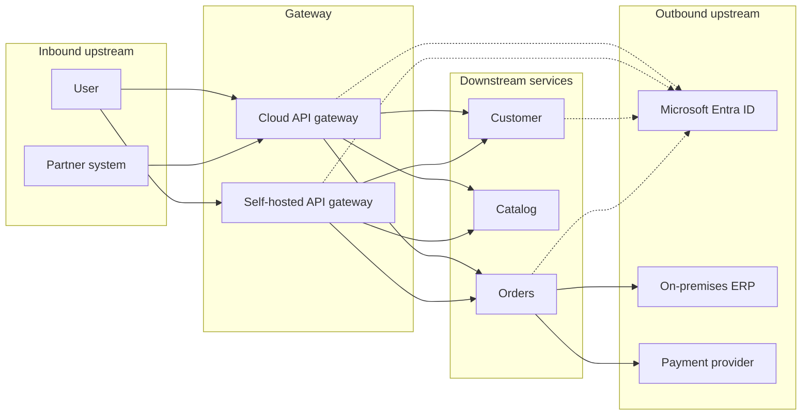
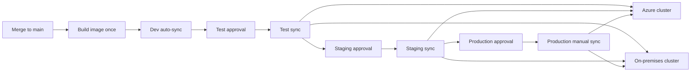

# Application architecture

Architect reference for a new application that deploys to Azure and uses the same workflow on hybrid and on-premises sites.

The application has one entry (the API gateway), one identity model (Microsoft Entra ID), and one deployment controller (Argo CD). Azure, a hybrid estate, and an on-premises site differ in network placement, not in process.

## Documents

| Document | What it decides |
| --- | --- |
| [Leadership briefing (Word)](docs/presentation/Application-Architecture-Briefing.docx) | Presentation for Security, Monitoring, and department leadership: architecture, each component, and why it was chosen |
| [System context](docs/01-system-context.md) | Where clients, the gateway, services, and clusters sit in Azure, hybrid, and on-premises |
| [Gateway](docs/02-gateway.md) | Why the gateway exists and what it owns |
| [Upstream and downstream](docs/03-upstream-and-downstream.md) | Services this application owns, and systems outside it |
| [Authentication](docs/04-authentication.md) | Token type, scope, and validation |
| [Delivery with Argo CD](docs/05-delivery-argocd.md) | Build once, approve, promote, and sync |
| [Platform standards](docs/06-platform-standards.md) | Components that protect the application and speed development |

## Terms

| Term | Meaning |
| --- | --- |
| Consumer | A person, partner, or system that calls this application |
| Gateway | The only supported entry. Cloud gateway in Azure, self-hosted gateway on-premises |
| Downstream service | A service this application owns and runs behind the gateway |
| Upstream service | A system outside this application. Inbound upstream calls the gateway. Outbound upstream is called by a downstream service |
| Site | One Kubernetes cluster: AKS in Azure, or Kubernetes on Azure Local or Azure Stack Hub |
| Promotion | Moving the same image digest to the next environment after the required approval |

## Runtime shape

## Delivery shape

Argo CD syncs each site from Git. A promotion changes the digest recorded for an environment. It does not rebuild the image. Production syncs only after approval, and the gateway route is published after downstream health passes.
