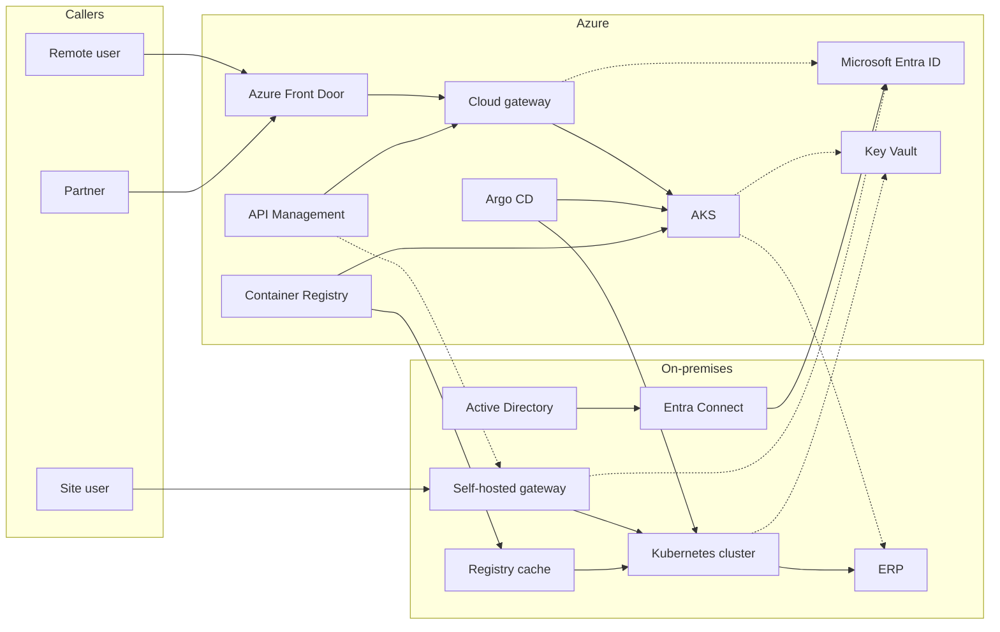
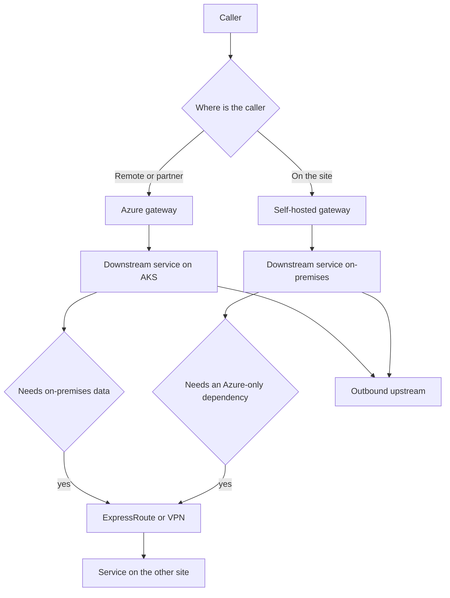

# System context

This application is a set of downstream services behind an API gateway. Users and partner systems call the gateway. The gateway validates the caller and routes to services this team owns. Those services call a small set of upstream systems when the work leaves the application boundary.

The same Git revision and the same container digest deploy to:

- **Azure** — AKS, reached through the cloud API gateway
- **On-premises** — Kubernetes on Azure Local or Azure Stack Hub, reached through a self-hosted gateway
- **Hybrid** — both sites at once. A call stays on the site that can serve it. Cross-site calls use a private network

Azure Arc registers the on-premises cluster so identity, policy, and inventory are visible in Azure. Argo CD, documented in [Delivery](05-delivery-argocd.md), is the only component that applies application manifests. Arc's Flux extension stays disabled for these namespaces so two reconcilers do not fight over the same objects.

## Placement

| Concern | Azure | Hybrid | On-premises |
| --- | --- | --- | --- |
| Caller entry | Front Door and the cloud gateway | Remote callers use Azure. Site callers use the self-hosted gateway | Self-hosted gateway on the site |
| Service runtime | AKS | AKS and the on-premises cluster | Kubernetes on Azure Local or Azure Stack Hub |
| Gateway configuration | API Management control plane | Same control plane publishes to both gateways | Same control plane. The gateway process runs on the site |
| Identity | Entra ID | Entra ID, fed by on-premises Active Directory | Entra ID while the site is connected |
| Image delivery | Azure Container Registry | Registry in Azure plus a connected registry or pull-through cache on-premises | Cache on the site, filled from Azure |
| Deploy controller | Argo CD | Argo CD in Azure, targeting both clusters | Argo CD targets the on-premises API. If that API cannot be reached, a second Argo CD on the site follows the same Git revision |

## Network paths

Rules for every environment:

- Callers have a route to a gateway and no route to a service pod.
- A downstream service calls another downstream service on the same site through the cluster network.
- A cross-site call uses ExpressRoute or site-to-site VPN.
- Egress to an outbound upstream leaves through a controlled path: private endpoint for Azure services, an allow-listed egress for a SaaS provider, and the site network for the ERP.
- A disconnected site keeps serving with the last published gateway configuration and the last synced manifests. It cannot refresh Entra signing keys or receive a new promotion until the link returns.

## What this application owns

Owned and deployed by Argo CD:

- Downstream services
- Their databases on each site
- The self-hosted gateway deployment
- Worker processes that consume the application's own queues

Owned as configuration, promoted by pull request, published to Azure:

- API Management APIs, policies, and backends
- Front Door routes
- Entra application registrations for this API

Not owned by this application:

- Entra ID, Active Directory, and Entra Connect
- The ERP, payment provider, and other outbound upstream systems
- The cluster platform: ingress class, secret store driver, policy engine, and the collector for telemetry
