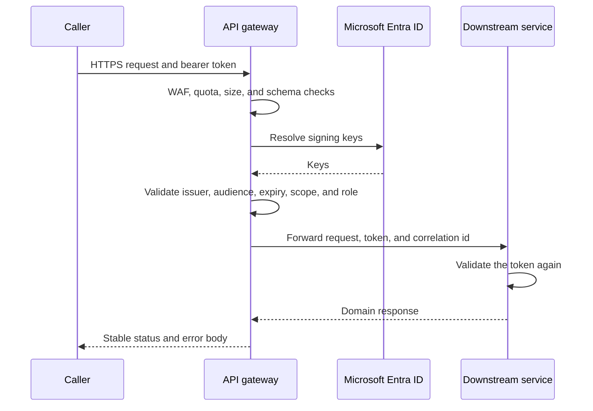

# Gateway

The gateway is the only door into the application. Azure API Management is the control plane. The cloud gateway serves remote callers. The self-hosted gateway serves callers on-premises. Both enforce the same API definitions and the same token policy.

Downstream services stay private. They still validate tokens. The gateway removes repeated edge work from every service and gives hybrid placement a single switch.

## What the gateway owns

```mermaid
flowchart LR
  subgraph callers [Callers]
    client[User or partner]
  end

  subgraph gatewayWork [Gateway responsibilities]
    tls[TLS and WAF]
    identity[Token validation]
    guard[Rate, size, and schema limits]
    route[Route and version selection]
    shape[Header and error shaping]
    trace[Access log and correlation id]
  end

  subgraph serviceWork [Left to downstream services]
    business[Business rules]
    ownership[Record ownership]
    data[Data and transactions]
    upstreamCall[Calls to upstream systems]
  end

  client --> tls
  tls --> identity
  identity --> guard
  guard --> route
  route --> shape
  shape --> trace
  trace --> business
  business --> ownership
  ownership --> data
  data --> upstreamCall
```

## Advantages

**One entry for every site.** Callers learn one hostname and one authentication scheme. Adding a service, splitting a service, or moving a service from Azure to the premises changes a route in the gateway. Clients keep the same URL.

**Hybrid routing without a client release.** A route's backend can be the AKS service, the on-premises service, or both. The self-hosted gateway prefers the local backend so a site user does not cross the WAN for a local catalog. The cloud gateway prefers AKS. Either gateway can fail over to the other site when that backend is marked healthy and the data is allowed to move.

**Authentication is consistent.** The gateway checks the Entra token before a pod spends CPU on the request. Every API uses the same issuer, audience, and scope rules from [Authentication](04-authentication.md). Services repeat the check so a stolen cluster path is still closed.

**Abuse stops at the edge.** Rate limits, quotas, body-size limits, and schema validation run once. A partner with a subscription key and a first-party app with a user token can share an API while receiving different quotas. WAF rules on Front Door sit in front of the cloud gateway. The self-hosted gateway applies the same API Management policies on the site.

**Version mediation.** The gateway can keep `/v1` stable while a downstream service moves to a new contract. An old on-premises client and a new mobile client call the same gateway and land on the revision they support. Protocol mediation belongs here when a legacy caller speaks SOAP or XML and the service speaks JSON.

**Faster and safer releases.** Gateway configuration is its own revision. A bad route is rolled back by making the previous API revision current, without redeploying pods. Caching of safe reads and response compression sit at the edge, close to the caller, including on-premises.

**One observation point.** Every accepted and rejected call is logged with a correlation id. The gateway forwards that id to the downstream service. Support can trace a partner call, a site call, and a cloud call in the same way.

**Smaller service code.** Services do not implement TLS certificates, partner subscription keys, quota, or client-specific payload tweaks. They implement the domain. That keeps the service deployable on AKS and on the on-premises cluster without site-specific code.

## Request path

A failed token check, an unknown route, or an over-quota caller ends at the gateway. The service does not see that request.

## What the gateway must not do

- Business decisions such as whether this customer may buy this product. That stays in the downstream service, because it needs the database and the domain rules.
- Trust in a client-supplied user id header. The gateway overwrites identity headers from the token. Services still validate the token.
- Direct exposure of pod addresses, internal ports, or upstream credentials.
- A separate policy language per site. Cloud and self-hosted gateways publish from the same API Management revision.

## Deployment interaction

The self-hosted gateway container is deployed by Argo CD with the cluster. The API operations, policies, and backends are promoted through Git and published to API Management after the downstream revision is healthy. The order is specified in [Delivery](05-delivery-argocd.md). Publishing the route last is what makes the gateway safe to put in front of a rolling release.
