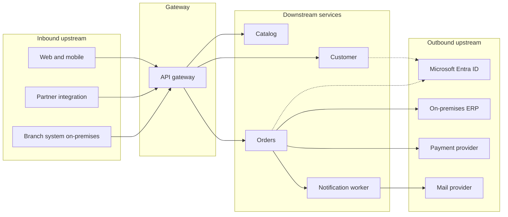
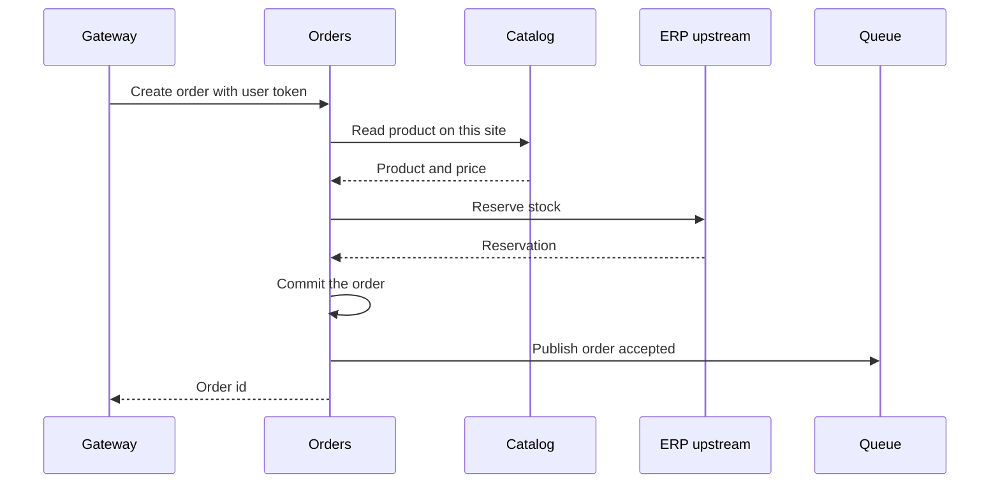

# Upstream and downstream services

Two groups of systems meet at this application.

**Downstream services** are built, deployed, and owned here. They sit behind the gateway. Callers cannot reach them directly.

**Upstream services** sit outside the trust boundary. Inbound upstream systems call the gateway. Outbound upstream systems are called by a downstream service when the work needs data or an action this application does not own.

## Downstream services

| Service | Responsibility | Calls |
| --- | --- | --- |
| Customer | Profile and account state for this application | Entra ID for token checks. Its own database |
| Catalog | Products that can be ordered | Its own database. No outbound business system |
| Orders | Accept and track an order | Catalog on the same site. ERP and payment upstream. Its own database |
| Notification worker | Deliver messages after an order is accepted | Mail provider. Reads the application's queue |

Rules:

- A service owns its data. Another service reads that data through an API, not through the database.
- Synchronous calls between downstream services stay on the same site.
- Work that can finish later, such as sending mail, goes to a queue. The API returns when the order is durable.
- Each service validates the Entra token. Scope selects the operation. The service then applies ownership rules, such as "this customer sees only their orders."
- Each service exposes `/healthz` for liveness and `/readyz` for readiness. Readiness includes its database. Orders also reports whether the ERP path it requires is reachable.
- The same image runs on AKS and on the on-premises cluster. Site differences are configuration: database address, ERP address, and Key Vault name.

Catalog does not call the ERP. Orders does, because stock reservation is part of placing an order. That keeps upstream credentials and retry policy in one service.

## Inbound upstream

These systems start a transaction. They are not deployed by this team's Argo CD applications.

| Caller | How it authenticates | Typical operations |
| --- | --- | --- |
| Web and mobile | User sign-in, authorization code with PKCE | Read catalog, create and read orders |
| Partner | Client credentials, application role | Submit an order for an agreed account |
| Branch system | Client credentials from a workload identity | Same contract as the partner, issued for the site |

They all use the gateway hostname for their site. They do not receive cluster credentials, database passwords, or ERP credentials.

## Outbound upstream

| Upstream | Why it is outside | How it is reached | Failure behavior |
| --- | --- | --- | --- |
| Microsoft Entra ID | Identity platform for the tenant | Public or private endpoint for the tenant. Signing keys are cached | Requests fail closed when keys cannot be validated |
| On-premises ERP | System of record for stock and fulfillment | Site network. From AKS, over ExpressRoute or VPN | Orders returns a clear upstream error and does not invent a reservation |
| Payment provider | Licensed payment processing | Allow-listed egress | The order stays unbilled and can be retried with the same idempotency key |
| Mail provider | Delivery channel | Allow-listed egress from the worker | The queue retries. The order API has already succeeded |

Outbound calls use a dedicated client per upstream, with a timeout, a bounded retry, and a circuit breaker. Credentials come from Key Vault through workload identity. They are not mounted as plain environment files in Git.

## Boundaries that keep hybrid simple

- Inbound upstream always stops at the gateway.
- Downstream services are the only code this team promotes through Argo CD.
- Outbound upstream contracts are isolated behind one downstream client each, so an ERP outage does not leak into Catalog or Customer.
- Moving Orders from Azure to the premises is a gateway backend change plus an Argo CD target change. Callers and the ERP contract stay as they are.
