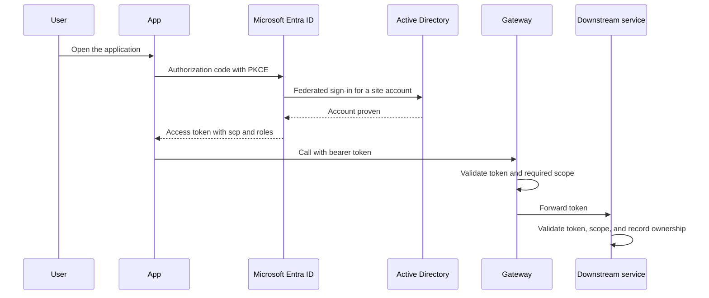
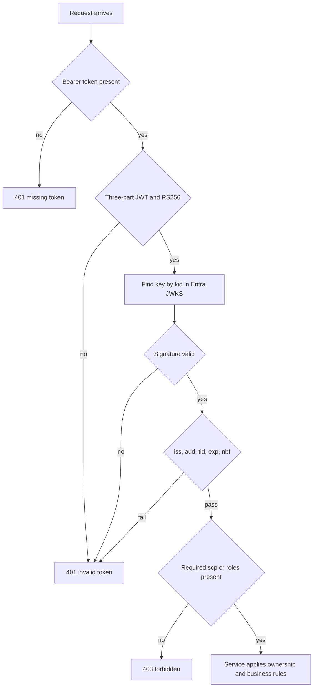

# Authentication

Every caller proves identity with Microsoft Entra ID. The access token is a signed JWT. The gateway and each downstream service validate it. Scopes and roles decide which operation is allowed. The service decides which records that operation may touch.

On-premises Active Directory remains the directory for site accounts. Entra Connect synchronizes those accounts to Entra ID. The token is still issued by Entra ID, so Azure and the premises trust the same issuer.

## Types

| Caller | Grant | Token contents used | Stored secrets |
| --- | --- | --- | --- |
| Person using web or mobile | Authorization code with PKCE | `scp` for delegated scopes, `roles` for app roles | None in the application. The public client has no secret |
| Partner or branch system | Client credentials | `roles` for application roles. No user `scp` | Certificate or federated credential, not a shared password |
| Downstream service calling Key Vault or another API | Workload identity federation | Application token for that resource audience | None in Git. The cluster projects a service account into Entra ID |
| On-premises service calling Azure | Workload identity on the Arc-enabled cluster | Same application token model as AKS | None in the image |

The resource-owner password grant is not used. Browser clients do not use the implicit grant. A service does not sign in with a person's username.

Refresh tokens stay with the client. Services accept access tokens only.

## Scope

Scopes are the contract between a caller and the API. They are coarse. Record-level rules stay in the service.

Delegated scopes, for a signed-in person, appear in the `scp` claim:

| Scope | Allows |
| --- | --- |
| `Catalog.Read` | Read products |
| `Orders.Read` | Read orders the caller is allowed to see |
| `Orders.Write` | Create an order for the signed-in customer |
| `Customer.Read` | Read the signed-in profile |

Application roles, for a partner or a worker with no user present, appear in the `roles` claim:

| Role | Allows |
| --- | --- |
| `Orders.Submit` | Submit an order for an account the partner is registered to serve |
| `Orders.ReadAll` | Read orders across customers. Limited to operations accounts |
| `Catalog.Sync` | Read catalog in bulk for a branch cache |

A token for a person must contain the delegated scope for the route. A token for an application must contain the application role. The gateway rejects the call when the claim is missing. The service rejects it again, then checks ownership:

- `Orders.Read` returns the caller's orders.
- `Orders.ReadAll` is required to read another customer's order.
- `Orders.Submit` may name a customer only when that customer is linked to the calling application id.

Audience is the API application ID URI, for example `api://contoso-apps`. Every gateway policy and every service expects that audience. A token minted for Microsoft Graph or for Key Vault is a different token and is rejected here.

## Validation

Validation order is the same on the cloud gateway, the self-hosted gateway, and every downstream service.

| Check | Accept | Reject |
| --- | --- | --- |
| Header | `Authorization: Bearer` | Missing header, or a raw token in the query string |
| Algorithm | `RS256` and a `kid` | `none`, symmetric algorithms, or a missing `kid` |
| Signature | Matches the Entra key for that `kid` | Unknown key or a bad signature |
| Issuer | `https://login.microsoftonline.com/{tenant}/v2.0` | Another tenant or a local unsigned token |
| Audience | This API's application ID URI | A token for a different API |
| Tenant | `tid` is the agreed tenant | A token from another directory |
| Time | `nbf` is in the past and `exp` is in the future, with a skew of five seconds | Expired or not-yet-valid tokens |
| Permission | Required scope in `scp`, or required role in `roles` | Authenticated caller without that permission |
| Client | `azp` or `appid` is in the allow list when the route is restricted | An unknown application, even with a broad role |

Keys are cached and refreshed on an unknown `kid`. If Entra cannot be reached and the cache has no match, the call fails closed.

Identity headers such as `x-user-id` are written by the gateway from `sub` after validation. Services may log them. Services authorize from the token, not from the header.

## Hybrid and on-premises

- Site users live in Active Directory. Entra Connect or Cloud Sync publishes them to Entra ID. A federated domain can check the password in Active Directory. Entra ID still issues the access token.
- The self-hosted gateway and the on-premises pods use the same issuer, audience, and scopes as AKS. There is no second user store inside the services.
- Workload identity on AKS and on an Arc-enabled cluster is how a pod calls Key Vault or an outbound API. That token's audience is the upstream resource, not this application's audience.
- A disconnected site can validate tokens only while the cached signing keys cover those tokens. Plan key cache lifetime to match the longest disconnection you accept. New sign-ins that need Active Directory federation wait for the link.

## Secrets around authentication

| Secret | Where it lives | Who can read it |
| --- | --- | --- |
| User password | Active Directory or Entra ID | The directory. This application never stores it |
| Partner credential | Entra certificate or federated credential | The partner's identity platform |
| API validation | Entra public signing keys | Anyone. Validation uses the public key |
| Downstream to Key Vault | Workload identity | The pod's service account |
| Gateway to API Management | Managed identity of the gateway host | The gateway host |

Tokens in logs are redacted. Refresh tokens and authorization codes are not written to traces.
