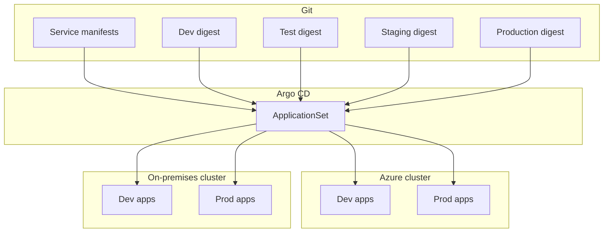
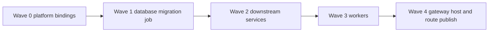
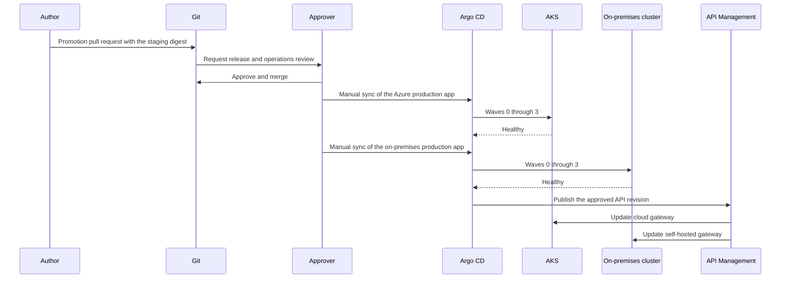

# Delivery with Argo CD

Speed comes from building the image once and promoting that digest. Safety comes from approvals in Git and from Argo CD applying only what Git records. Azure and on-premises clusters sync the same digest. They do not run separate build pipelines.

Argo CD is the deployment controller. Azure Arc registers the on-premises cluster for inventory, policy, and workload identity. The Arc Flux extension is not used for these applications, so a second controller does not overwrite Argo CD.

## Promotion


| Environment | How the digest moves | Approval | Argo CD | Sites |
| --- | --- | --- | --- | --- |
| Dev | CI commits the new digest | Pull request review into main is enough | Auto-sync | Azure and on-premises |
| Test | Promotion pull request from the dev digest | One reviewer | Auto-sync after merge | Both |
| Staging | Promotion pull request from the test digest | Tech lead | Auto-sync after merge | Both |
| Production | Promotion pull request from the staging digest | Release manager and operations | Manual sync inside a change window | Both, as separate applications |

A promotion pull request changes the digest and the Git revision pointer. It does not rebuild the container. Approvers see an Argo CD diff in the pull request: the objects that will change on each site.

Production applications have automated sync turned off. Merging the pull request does not move production. An operator syncs the Azure application and the on-premises application after the approval. Self-heal stays on after that sync so drift is returned to the approved Git revision.

## What is fast, and what stays gated

Fast path:

- Main is always releasable. Feature work lands in short pull requests.
- CI runs unit tests, API contract tests, and an image scan before it pushes.
- The image is pushed once to Azure Container Registry and referenced by digest.
- A connected registry or pull-through cache on-premises copies that digest. The on-premises cluster does not depend on a second build.
- Dev and test sync as soon as Git changes, to both sites in parallel.
- A pull request can create a short-lived preview on the dev cluster through an Argo CD ApplicationSet. Preview uses the dev data class and is removed when the pull request closes.
- Feature flags separate "the code is deployed" from "the behavior is released," so a promotion does not have to wait for a marketing date.

Gated path:

- Staging and production only move by promotion pull request.
- Production additionally needs a manual Argo CD sync.
- Admission control on every cluster rejects an image that is not signed by this pipeline.
- The gateway revision is published after downstream readiness, never before.

## Argo CD layout

One Argo CD in Azure manages the AKS cluster and the on-premises cluster. The on-premises Kubernetes API is reached over the private network. If a site forbids inbound access to that API, install a second Argo CD on the site and point it at the same Git paths. Approvals remain in Git, so both controllers promote the same digest.



Each combination of service, environment, and site is its own Argo CD Application. A failed on-premises sync does not roll back the Azure application. The promotion digest is still one value, so the sites are meant to match. The degraded site is repaired or the promotion is reverted in Git.

Suggested repository layout:

```text
apps/
  customer/
  catalog/
  orders/
  gateway-host/
environments/
  dev/
  test/
  staging/
  prod/
clusters/
  azure/
  on-premises/
```

`apps` holds the workload. `environments` holds the digest and the replica counts for that stage. `clusters` holds addresses that differ by site, such as the database endpoint and the Key Vault name. Image identity does not change between `azure` and `on-premises`.

## Sync order inside a site

Argo CD sync waves apply dependencies before callers.



| Wave | Objects | Ready means |
| --- | --- | --- |
| 0 | Namespace, service account, workload identity, secret store | The pod can obtain a Key Vault token |
| 1 | Migration job | The job completed. The previous application revision still runs |
| 2 | Customer, Catalog, Orders | Readiness probes pass |
| 3 | Notification worker | The worker is connected to its queue |
| 4 | Self-hosted gateway deployment, then API Management revision | Downstream readiness is green and the gateway loaded the new revision |

Wave 4 is split on purpose. Argo CD rolls the gateway container. A pipeline step publishes API Management configuration only after Argo CD reports the downstream applications healthy. API Management then pushes that revision to the cloud gateway and the self-hosted gateway. The previous API revision stays current until the new gateways pass their own readiness checks.

Migrations expand first and contract later. A migration in the same promotion is compatible with the previous pods, so a rollback of the deployment does not require a rollback of the schema.

## Production sync workflow



Either site can be synced first. The API revision is published when each site that should receive traffic is healthy. A site that failed its sync is left on the previous gateway backend.

Rollback is a Git revert of the digest, followed by the same sync. Argo CD returns the cluster to the previous specification. The API Management revision is set back to the previous current revision. Pod rollback does not wait for a new image build because the old digest is still in the registry.

## Controls that keep a promotion flawless

- Production image references are digests, not floating tags.
- CI signs the image. Cluster policy rejects unsigned images on Azure and on-premises.
- Required status checks on the promotion pull request: tests, scan, signature, and the Argo CD diff.
- Production sync is manual and windowed.
- Sync waves block the gateway publish on failed health.
- Separate applications per site isolate a bad node pool or a down ERP path.
- Self-heal corrects drift after the approved sync.
- Database changes are backward compatible for one promotion so the previous digest can run again.
