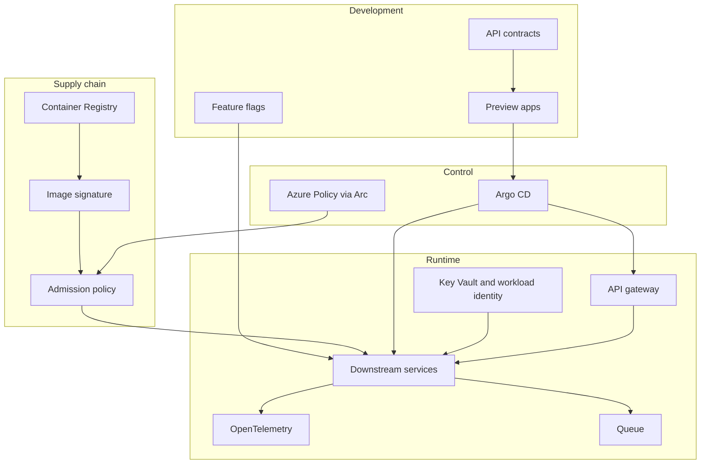
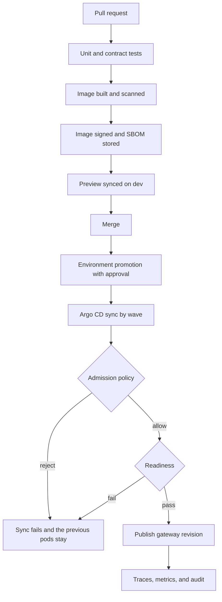

# Platform standards

These components sit beside the gateway, the services, and Argo CD. Each one is here because it improves the running application, the team shipping it, or both. All of them run the same way against AKS and against Kubernetes on-premises.

## Standards

| Component | Advantage for the application | Advantage for development |
| --- | --- | --- |
| API gateway, cloud and self-hosted | One secured entry, hybrid routing, quotas, and stable client contracts | Services stay free of edge code and deploy unchanged on each site |
| Entra ID, scopes, and token validation | One identity on Azure and on-premises, with failed calls rejected before business logic | A single test token shape for every service |
| Argo CD | The cluster matches Git. Production moves only on an approved sync | Promotion is a digest change and a diff, not a custom deploy script |
| Immutable digests and "build once" | The bits approved in staging are the bits synced to production | No rebuild delay and no "it was rebuilt differently" defect |
| Image signing and admission | Clusters refuse images that did not come from the pipeline | A bad or substituted image fails at deploy time on every site |
| Vulnerability scan and SBOM in CI | Known vulnerable builds never reach a promotion pull request | The author sees the finding on the same day, while the change is small |
| API contracts in Git | Gateway and services share one schema. Old clients keep working through a versioned route | Contract tests on the pull request replace a full environment for most changes |
| Preview application per pull request | Reviewers exercise the change on the dev cluster | Feedback arrives before merge, without a shared environment queue |
| Feature flags | Deploy and release are separate, so a promotion can stay dark until the business is ready | Incomplete work can merge without exposing it |
| Key Vault and workload identity | Secrets are not in images or Git. Pods on AKS and on Arc use the same pattern | Developers do not handle production passwords |
| External Secrets or the Key Vault provider | Pods receive only the secrets they need, rotated outside the image | Local development uses the dev vault, not a copy of production |
| OpenTelemetry | One trace from the gateway correlation id through downstream calls and outbound upstream calls | Production failures can be reproduced from a trace instead of a redeploy |
| Azure Monitor, fed from both sites | One place to alert on latency, error rate, and saturation | The same dashboard covers Azure and on-premises |
| Health and readiness probes | Argo CD and the gateway only send work to ready pods | A failed migration or a down database blocks the wave instead of failing callers at random |
| Queue between Orders and notification | The order API stays fast and succeeds when mail is slow | Retries and dead letters are visible. Developers do not build hidden retry loops |
| Idempotency key on create-order | A retried client request does not create a second order or a second payment | Tests can retry safely |
| Timeouts, bounded retries, and circuit breakers on upstream calls | A slow ERP does not exhaust the Orders pods | Failure mode is explicit and testable |
| Network policy and private connectivity | Services are unreachable except from the gateway and their allowed peers. ExpressRoute or VPN carries cross-site traffic | Default-deny makes accidental exposure visible in review |
| Kyverno or Gatekeeper on every cluster | Limits, required probes, and signature checks are enforced on-premises the same as in Azure | Policy failures appear at sync time with a clear message |
| Azure Policy on Arc | Organization rules are reported for the on-premises cluster as well as AKS | Exceptions are recorded, not applied by hand on a server |
| Backward-compatible migrations | Rollback of a digest does not require a reverse schema change during the incident | Authors can ship schema and code in one promotion |
| APIOps for API Management | Gateway routes and token policies are reviewed in Git and promoted like services | Edge changes show up in the same pull request workflow |
| SLOs and error budget | Release speed slows when the user-facing error rate is already too high | The team has an agreed signal for "ship" versus "stabilize" |
| Structured audit log | Order creation, role denials, and gateway rejects are attributable to a subject | Incident review does not depend on shell history |

## How they fit the promotion

The application gains a single security and runtime posture on every site. Development gains short pull requests, a preview, and a promotion that is only a digest plus an approval.
