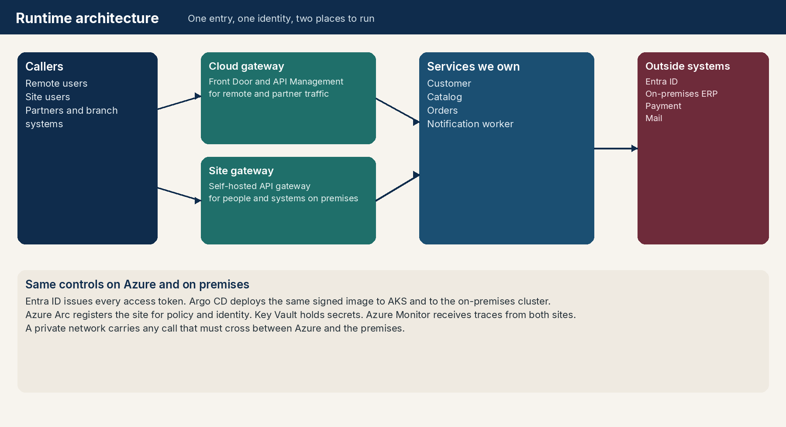
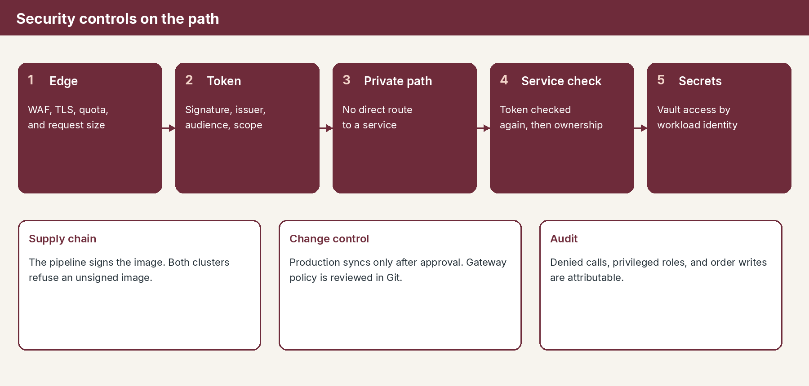
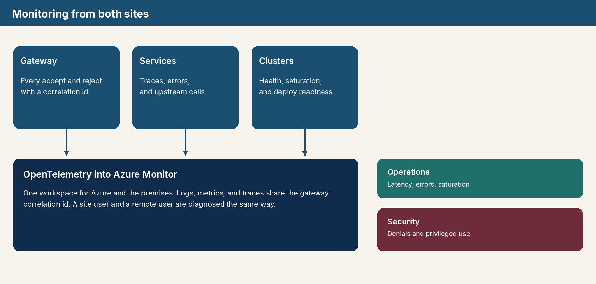
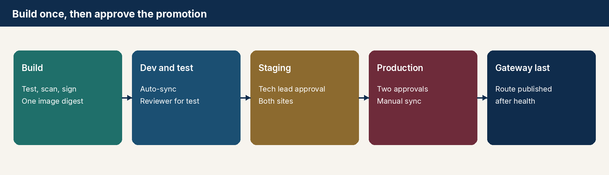

# Leadership briefing

Word document for Security, Monitoring, and department leadership:

**[Download Application-Architecture-Briefing.docx](https://github.com/charyvgk/APPS/raw/cursor/gateway-auth-deployment-fcff/docs/presentation/Application-Architecture-Briefing.docx)**

Open that link, then use **Download** if the browser shows a preview instead of saving the file. GitHub does not display Word documents inside the pull request diff. The file is about 290 KB.

The same diagrams are below so the briefing can be read on this page.

## Runtime architecture

## Security controls

## Monitoring

## Release control

The component-by-component reasons, and the decisions asked of Security and Monitoring, are in the Word document.
